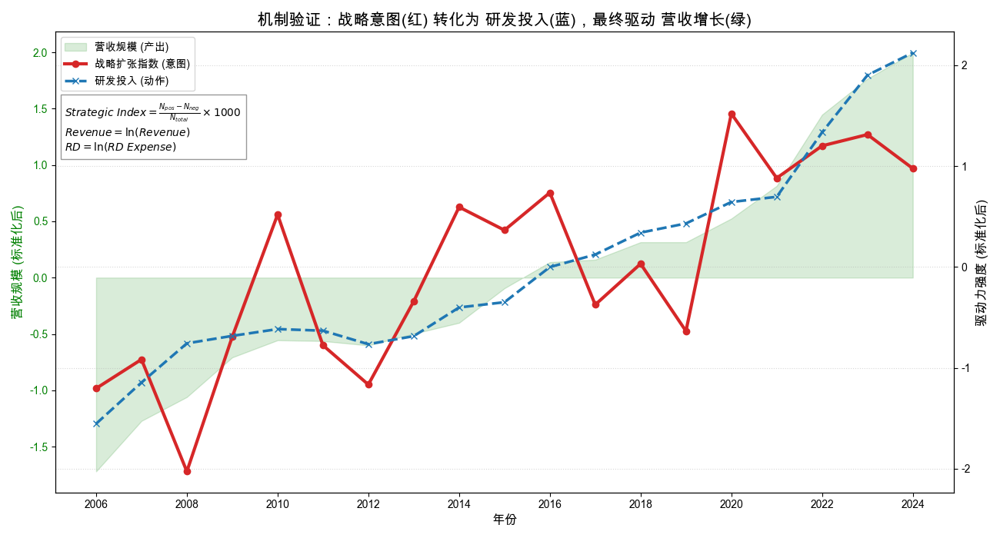

# 文本挖掘在财务分析中的应用：比亚迪年报情感分析与战略识别 (2002-2024)

> **基于战略意图驱动企业规模跃升的实证研究**

[](https://www.python.org/)
[](https://huggingface.co/)
[](https://www.statsmodels.org/)

## 📖 项目简介 (Introduction)

本项目以 **比亚迪集团 (01211.HK)** 2002-2024 年共 23 年的年报管理层讨论与分析 (MD&A) 文本为研究对象，旨在探究管理层语调与企业战略意图对财务绩效的驱动机制。

不同于传统研究仅关注通用情感分析，本项目构建了**“双轨验证”框架**，对比了基于深度学习的 **Financial-BERT** 模型与基于行业特化词典的 **“战略扩张指数”**。研究发现，在硬科技制造业语境下，识别“企业在做什么（扩张）”比识别“企业感觉如何（情绪）”更具预测价值。

## 🚀 核心发现 (Key Findings)

1.  **通用情感失效**: 基于通用语料微调的 RoBERTa 情感得分对制造业营收增长无显著预测力 ($P>0.1$)。
2.  **战略意图驱动**: 本文构建的“战略扩张指数”与企业营收规模呈极显著正相关 ($P<0.001$)。
3.  **完全中介效应**: 统计检验均证实，**研发投入**在战略意图与营收增长之间起到了完全中介作用，验证了“战略意图 $\to$ 研发投入 $\to$ 营收规模”的传导路径。
4.  **战略韧性预警**: 2019 年比亚迪财务表现低迷，但“战略韧性指数”逆势创出新高，成功预警了随后的业绩反转。

## 📊 可视化展示 (Visualization)

*(此处展示项目生成的关键图表)*

### 1. 战略演进河流图 (LDA Topic Evolution)
利用 LDA 主题模型无监督聚类，精准复现了比亚迪从“代工起步”到“多元转型”再到“技术爆发”的三次战略跃迁。


### 2. 机制传导全景图 (Mechanism Transmission)
直观展示了战略意图（红线）如何驱动研发投入（蓝线），最终转化为营收规模（绿面）的同步攀升过程。


## 📂 项目结构 (Structure)

```
.
├── data/                 # 数据文件夹
│   ├── 01_text.csv       # 清洗后的 MD&A 文本数据
│   ├── 02_financials_roe.csv # 财务指标数据
│   └── ...               # 生成的图表和结果文件
├── src/                  # 源代码文件夹
│   ├── analysis.py       # 核心分析脚本
│   └── ...
├── requirements.txt      # 依赖库列表
└── README.md             # 项目说明
```

## 🛠️ 如何运行 (How to Run)

### 1. 环境准备
建议使用 Python 3.8 或更高版本。


### 2. 模型准备 (重要)
由于 GitHub 文件大小限制，本项目未上传微调后的 BERT 模型。
*   **选项 A**: 如果你想复现情感分析部分，请自行下载 `bert-base-chinese` 并进行微调，或修改代码使用 HuggingFace 在线模型。
*   **选项 B**: 直接运行代码，程序会自动检测模型是否存在。如果不存在，将自动跳过情感分析部分（或使用默认值），不影响核心的“战略扩张指数”计算。

### 3. 运行分析
直接运行主脚本即可复现所有结果和图表：

```bash
python src/analysis.py
```

程序将自动执行以下步骤：
1.  **数据清洗**: 加载并清洗年报文本。
2.  **特征提取**: 计算战略扩张指数（核心指标）。
3.  **模型回归**: 运行 4 个 OLS 回归模型及稳健性检验。
4.  **图表生成**: 在 `data/` 目录下生成 4 张可视化图表。

## 📝 方法论 (Methodology)

*   **NLP 模型**: `bert-base-chinese` (Fine-tuned on SILC-EFSA)
*   **主题模型**: Latent Dirichlet Allocation (LDA)
*   **统计方法**: OLS Regression, Mediation Analysis (Baron & Kenny)
*   **词典构建**: 基于 Loughran & McDonald (2011) 逻辑的行业特化词典

## 📜 许可证 (License)

MIT License
